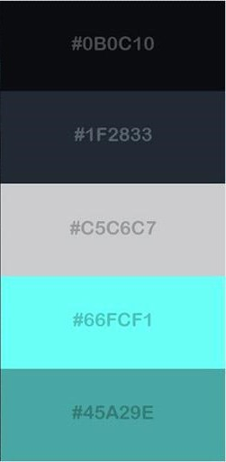

<h1>Mega Project</h1>

We are going to make a website with all the basic mini applications available in it. It will fulfil every induvial basic needs.

<h2>Mini applications:</h2>
<ul>
<li>TO-DO application - k</li>
<li>Basic calculator - B</li>
<li>Tip calculator - B</li>
<li>BMI calculator - K</li>
<li>Permanent Digital clock on every page</li>
<li>Login and sign on navigation (onClick it will generate the modal)</li>
<li>Budget application (Bit diificult but we can try) - B</li>
<li>School grade calculator - K</li>
</ul>

<h2>Folder structure:</h2>

<h3>Name of website (folder)</h3>

<ul>
<li>Assets(will include all images, audio, video, CSS folder, JS folder)</li>
<li>Home page</li>
<li>Project page</li>
<li>Contact page</li>
</ul>

<h2>Task:</h2>
<ul>
<li>Mindmapping</li>
<li>Design UI using HTML/CSS/BS</li>
<li>Start logic using JS/jQuery</li>
</ul>

<h2>Color codes<h2>

 

Note : we will not copy anything from anywhere. We can do it. 
Pages : 8 
 

Home
Nav : Home, projects, contact, login / sign – B
Mega project – content
Card – about each project

